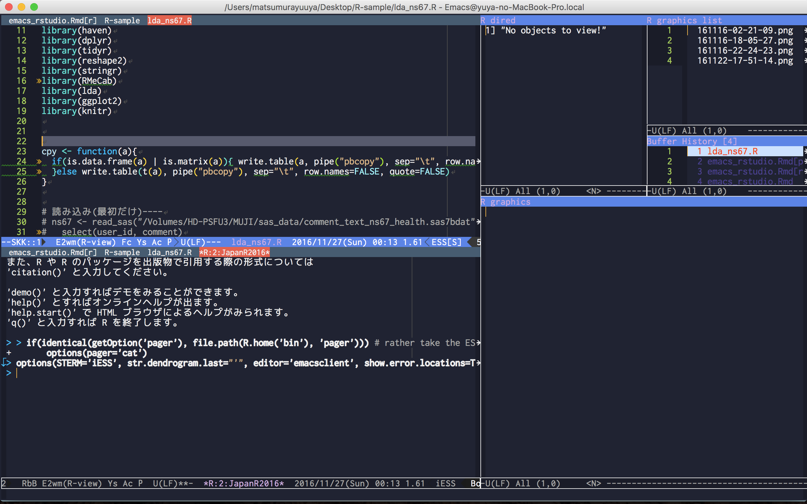
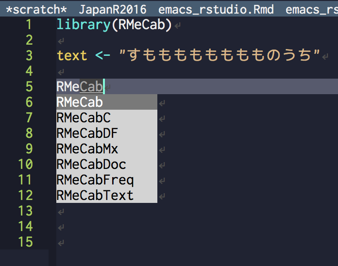
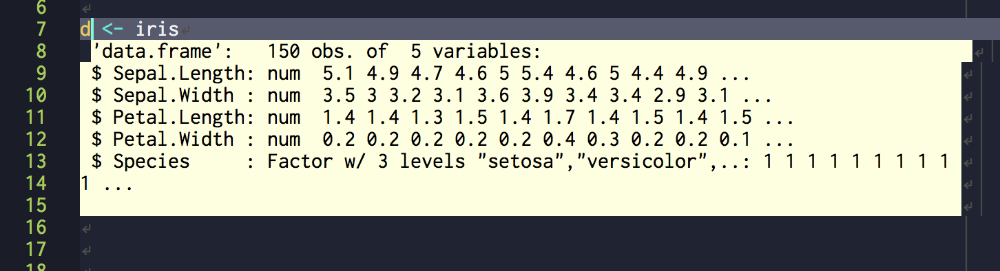
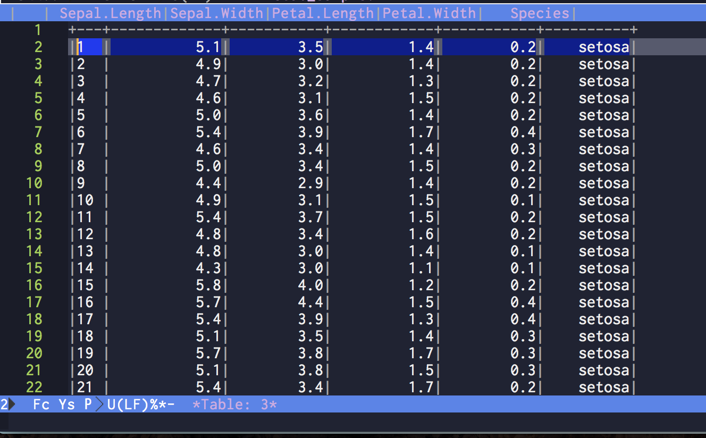
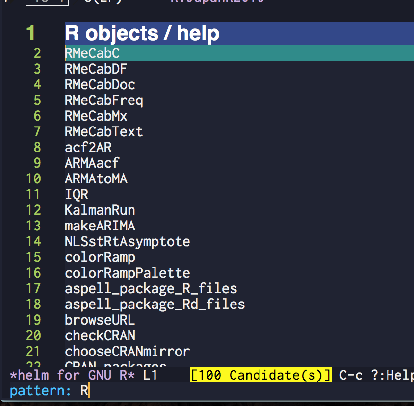
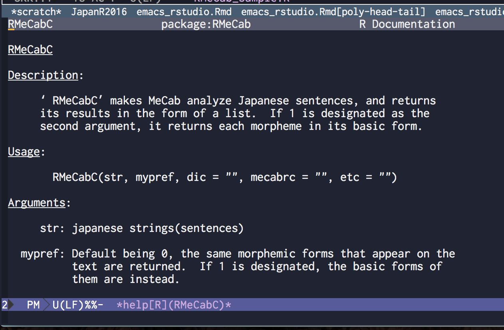
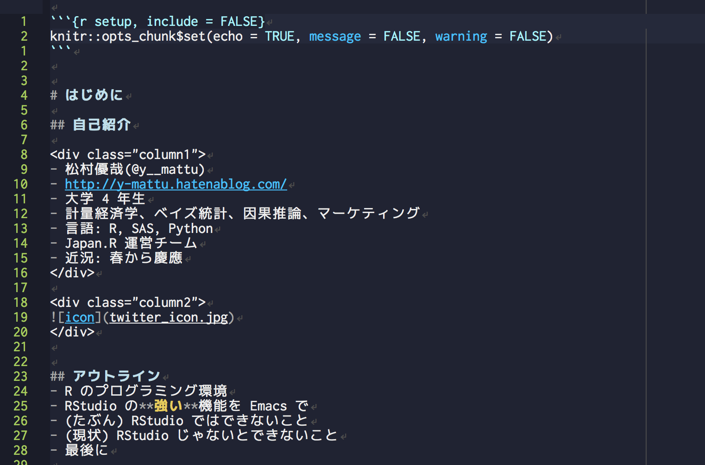
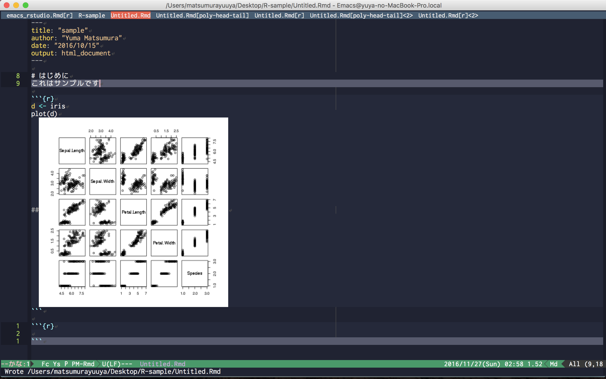

```{r setup, include = FALSE}
knitr::opts_chunk$set(echo = TRUE, message = FALSE, warning = FALSE)
```


# はじめに

## 自己紹介

<div class="column1">
- 松村優哉(@y__mattu)
- http://y-mattu.hatenablog.com/
- 大学 4 年生
- 計量経済学、ベイズ統計、因果推論、マーケティング
- 言語: R, SAS, Python
- Japan.R 運営チーム
- 近況: 春から慶應
</div>

<div class="column2">

</div>


## アウトライン
- R のプログラミング環境
- RStudio の**強い**機能を Emacs で
- (たぶん) RStudio ではできないこと
- (現状) RStudio じゃないとできないこと
- 最後に


# R のプログラミング環境

## やっぱ定番! RStudio!
- R の統合環境のデファクトスタンダード
- R で分析するための機能はほぼ揃ってる
- レポート作成もできるし最高!


## RStudio 社の Hadley 氏も
> RStudio は、ほとんどの R ユーザーにとってベストだと私が考えている開発環境です。

<div style="text-align: right;">
『 R パッケージ開発入門』より
</div>


## Hadley 氏は一方で
> RStudio の唯一の競争相手は、Emacs Speaks Statistics (ESS) (https://ess.r-project.org/) だと思います。Emacs を学び、自分に合うようにカスタマイズする時間を費やすのを惜しまない人にとっては、やりがいのある開発環境でしょう。

<div style="text-align: right;">
『 R パッケージ開発入門』より
</div>


## ESS とは
- Emacs で統計関連の言語を記述・実行するためのパッケージ
- 対応言語は R, S-PLUS, SAS, STATA, BUGS/JAGS, Julia
- 構文ハイライトの色、ウィンドウ構成など挙動の全てをカスタマイズ可能
- 設定は Emacs Lisp で書く
- Emacs なのでキーボードでほとんどの操作が可能


## スクリーンショット
*.R ファイルを開くと自動でウィンドウ分割して R を起動するよう設定


## ウィンドウ切り替えも
切り替えを好みのショートカットで一発



# RStudio の**強い**機能を Emacs で


## 補完
- **auto-complete.el**
- ライブラリ名もオブジェクト名も関数名もバッチリ




## オブジェクトのサマリー
- **ess-R-object-popup.el**
- オブジェクト上にカーソルを合わせて `\C-c \C-g (ctrl+c+g)` で `summary()` の結果がポップアップ表示




## オブジェクトの中身
- **ess-R-object-popup.el**
- オブジェクト上にカーソルを合わせて `\C-c v (ctrl+c v)` で 中身が別ウィンドウで開く




## 関数のヘルプ
- **helm-R.el**で絞り込むと



## こんな感じで読める



## R Markdown
<div class="column1">
- **polymode.el**
- 一つのバッファに複数の<br>言語モードを混在させる<br>
→ R + Markdown<br>
→どっちもきちんとハイライトされる
- `rmarkdown::render()` を実行する Emacs の関数を作り HTML 化
</div>

<div class="column2">

</div>


## R Notebook
<div class="column1">
- RStudio 1.0 から正式採用
- HTML 変換は R Markdown の YAML
    - `output: html_notebook`
- インライン画像表示は**inlineR.el** (Emacs は元々普通に画像表示ができる)
</div>

<div class="column2">

</div>


## ウィンドウ管理
- **e2wm-R.el**


# (たぶん) RStudio ではできないこと
## パラグラフ単位での実行
- `\C-c \C-c` でパラグラフを実行
- `\C-c \C-j` で現在行を実行 <br>
→範囲選択の必要なし !

## オブジェクトへの色付け
- `~/.emacs.d/init.el` (Emacs の設定ファイル) に以下のように書く。お好みで。
```{Rcpp init, eval = FALSE}
(defvar ess-R-fl-keyword:assign-vars
  (cons "\\(\\(?2:\\s\"\\).+\\2\\|\\sw+\\)\\s-*\\(<-\\)"
        '(1 font-lock-variable-name-face)))

(add-to-list 'ess-R-font-lock-keywords '(ess-R-fl-keyword:assign-vars . t) t)
```


## "<-" の一発入力
- `_` を入力すると自動で `<-` になる
- 普通に `_` にしたいときは `_` を二回続けて入力


# (現状) RStudio じゃないとできないこと

## マウスでグリグリするやつ
javascript ベースで描画するパッケージ (leafret, plotly, dygraphs,...) はブラウザじゃないと見られない<br>
→テキストエディタの限界？

## 希望はある？
- xwidget(Emacs 25 より正式実装)
- Emacs 上でフルブラウザが動く
- javascript ももちろん動く

# 最後に

## 環境選び
<div class="column1">
RStudio が向いてる人

- R しか使わない
- 細かいことにこだわらない
- RStudio が好き
- RStudio でいい
- Lisp とかめんどい。
</div>

<div class="column2">
ESS が向いてる人

- 複数言語を使用、全部を同じキーバンドでやりたい
- 自分に合う環境を作り込みたい
- RStudio が嫌い
- マウスを使いたくない
</div>


## 続きはアドカレで!
この話の詳細(実装方法など)は [RStudio Advent Calendar](http://qiita.com/advent-calendar/2016/rstudio-ide) 22 日目の記事で書く予定です

## Enjoy !!
本日の資料置き場

[GitHub](https://github.com/ymattu/JapanR2016)


